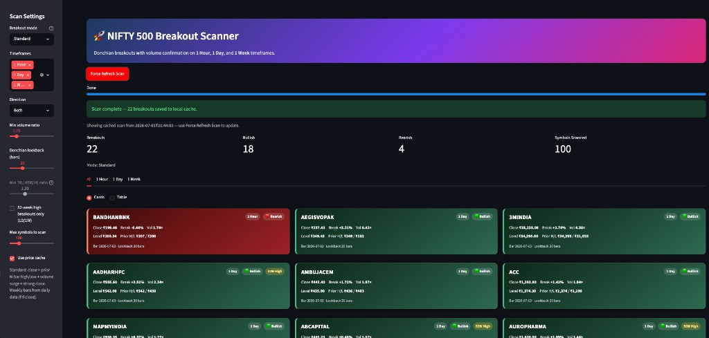

# NIFTY 500 Breakout Scanner

A multi-timeframe stock breakout scanner for **NIFTY 500** constituents. Detects Donchian-style resistance/support breaks with volume confirmation on **1 Hour**, **1 Day**, and **1 Week** bars.

Built with Python, [yfinance](https://github.com/ranaroussi/yfinance), and [Streamlit](https://streamlit.io/).

**Repository:** [github.com/Elicherla01/breakoutscanner](https://github.com/Elicherla01/breakoutscanner)

## Screenshot

Streamlit dashboard — sidebar scan settings, force-refresh cache, and card view of bullish/bearish breakouts across 1H / 1D / 1W.



---

## Features

- **Three timeframes:** 1H (yfinance hourly), 1D (daily), 1W (weekly resampled from daily)
- **Two detection modes:**
  - **Standard** — Donchian break + volume surge + strong close
  - **Strict (ATR)** — Standard rules + true range > ATR multiplier × ATR(14)
- **Bullish & bearish** breakouts
- **Card and table views** with candlestick charts
- **Local CSV cache** — scan results persist across app restarts; refresh only on **Force Refresh**
- **CLI** for headless scans and automation

---

## Quick start

```bash
git clone https://github.com/Elicherla01/breakoutscanner.git
cd breakoutscanner
python -m venv .venv
source .venv/bin/activate   # Windows: .venv\Scripts\activate
pip install -r requirements.txt
streamlit run app.py
```

Open the URL shown in the terminal (default `http://localhost:8501`).

---

## Breakout logic

### Bullish

```
close > rolling_max(high, N).shift(1)
AND volume > vol_mult × SMA(volume, 20)
AND close in upper portion of bar (strong close)
```

### Bearish

```
close < rolling_min(low, N).shift(1)
AND volume > vol_mult × SMA(volume, 20)
AND close in lower portion of bar (strong close)
```

### Strict mode (additional filter)

```
true_range > atr_mult × ATR(14)
```

True range uses gaps: `max(H−L, |H−prev_close|, |L−prev_close|)`.

Default strict thresholds: **1.5×** volume, **1.2×** ATR (1.0× ATR on 1H).

---

## Project layout

```
breakoutscanner/
├── app.py              # Streamlit UI
├── breakout.py         # Breakout detection engine
├── config.py           # Timeframe settings & constants
├── data_loader.py      # NIFTY 500 universe + OHLCV fetch/cache
├── results_store.py    # Scan CSV persistence
├── scanner.py          # Parallel universe scan
├── run_scanner.py      # CLI entry point
├── requirements.txt
├── docs/
│   └── images/
│       └── dashboard-screenshot.png
├── README.md
└── IMPLEMENTATION.md   # Detailed setup & operations guide
```

---

## CLI usage

```bash
# Launch UI
python run_scanner.py app

# Scan first 100 symbols, all timeframes, strict mode
python run_scanner.py scan --max 100 --mode strict -t 1H -t 1D -t 1W

# Export to custom path (also updates app cache)
python run_scanner.py scan --max 500 -t 1D --csv breakouts.csv
```

---

## Configuration

| Setting | Default | Description |
|---------|---------|-------------|
| Lookback (N) | 20 bars | Donchian window |
| Volume mult | 1.25 (standard) / 1.5 (strict) | Min volume vs 20-bar avg |
| ATR mult | 1.2 | Strict mode TR/ATR threshold |
| Max symbols | 100 (UI slider) | Slice of NIFTY 500 universe |

**Tip:** For representative results across the full index, set **Max symbols to scan** to **500**.

---

## Data sources

- **Universe:** [NSE NIFTY 500 list](https://archives.nseindia.com/content/indices/ind_nifty500list.csv) (cached locally)
- **Prices:** Yahoo Finance (`.NS` suffix for NSE symbols)

Cached files are stored under `data_cache/` (gitignored).

---

## Disclaimer

This tool is for **educational and research purposes only**. It is not investment advice. Past breakouts do not guarantee future performance. Verify signals independently before trading.

---

## License

MIT License — see [LICENSE](LICENSE).

---

## Implementation guide

See **[IMPLEMENTATION.md](IMPLEMENTATION.md)** for step-by-step installation, configuration, deployment, and troubleshooting.
